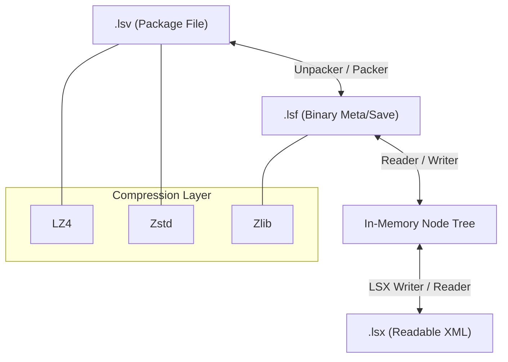
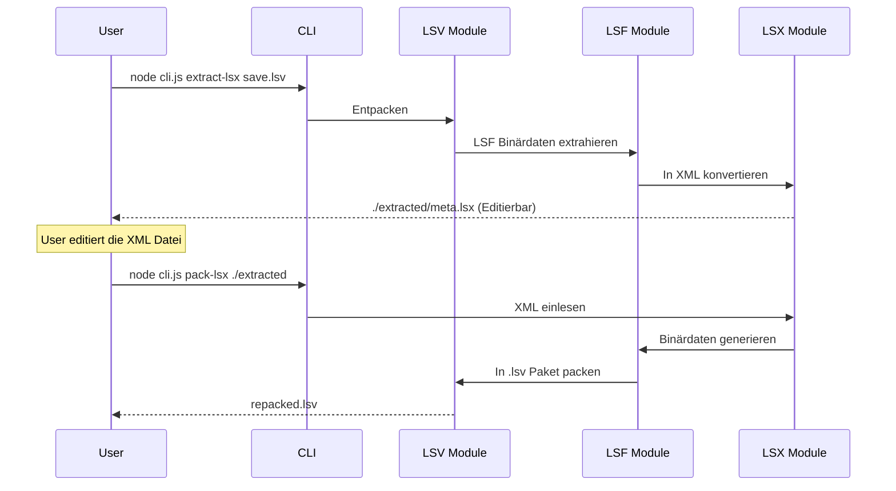

# Projekt-Dokumentation: Diagramme

Diese Seite enthält die visuellen Darstellungen der Projekt-Architektur und der Workflows.

## Kern-Architektur

Diese Grafik zeigt das Zusammenspiel der verschiedenen Dateiformate und der internen Verarbeitungslogik.

## Workflow: Extraktion und Repacking

Der typische Ablauf, um ein Savegame zu editieren.

